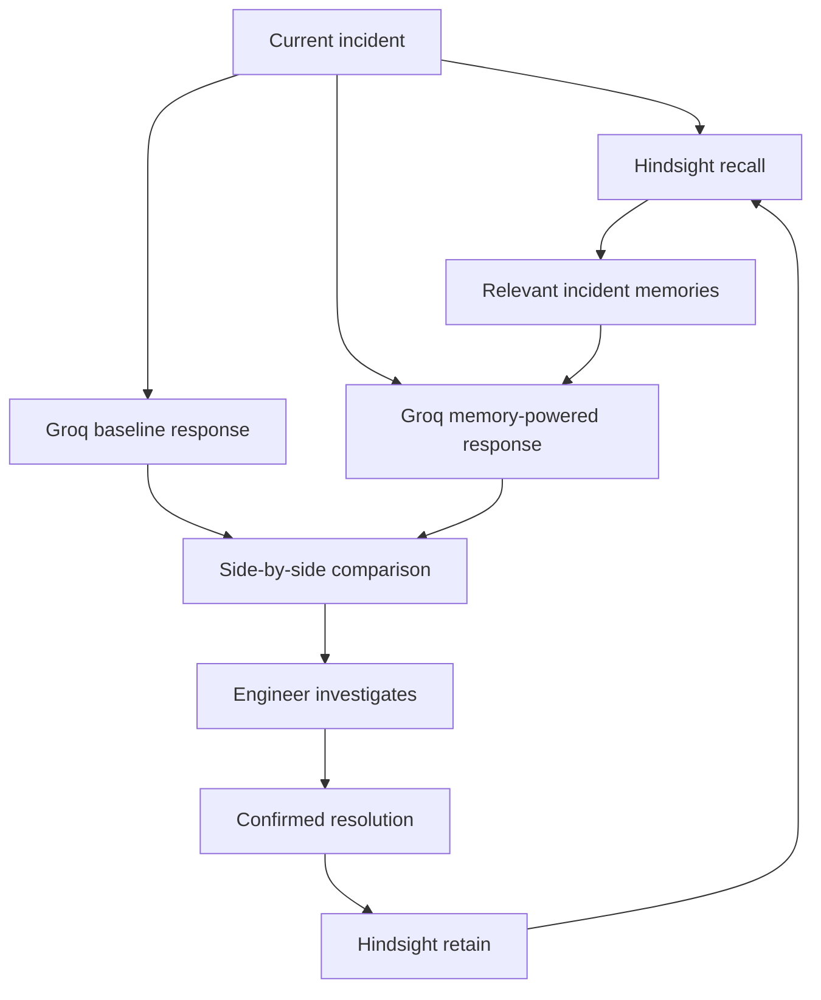

# Incident Memory Agent

A memory-powered software incident investigation assistant built with **Hindsight**, **Groq**, and **Streamlit**.

The agent recalls relevant past incidents, compares generic guidance against memory-powered guidance, and learns from confirmed root causes and resolutions.

## The Problem

Engineering teams repeatedly encounter similar production failures, but important context is often scattered across chat messages, post-mortems, tickets, and individual team members’ memories.

During an outage, engineers may waste valuable time rediscovering:

- What caused a similar incident
- Which investigation steps were useful
- Which resolution restored the service
- Which preventive actions were recommended

A normal stateless chatbot does not remember previous incidents. Incident Memory Agent uses persistent memory to make previous engineering experience available during future investigations.

## Solution

The application supports a continuous incident-learning workflow:

1. An engineer describes a current incident.
2. Hindsight recalls relevant historical incident memories.
3. Groq generates evidence-aware investigation guidance.
4. The application compares guidance without memory against guidance with Hindsight.
5. Engineers investigate using live logs and system data.
6. After confirming the root cause, they record the resolution.
7. Hindsight retains the confirmed incident for future use.

## Why Hindsight Is Central

Hindsight is not an optional feature in this project. It is the core memory layer.

The application uses Hindsight in two main ways:

### Recall

When a new incident is submitted, the application calls Hindsight to retrieve semantically relevant historical incidents.

The recalled information may include:

- Previous symptoms
- Affected services
- Confirmed root causes
- Successful resolution steps
- Preventive actions

### Retain

After engineers verify an incident, the application stores a structured record containing:

- Incident date
- Service
- Environment
- Severity
- Observed symptoms
- Confirmed impact
- Confirmed root cause
- Resolution
- Prevention or follow-up action

This creates a learning loop where every confirmed incident can improve future investigations.

## Memory Impact Comparison

The application analyzes the same incident in two different ways:

### Without Memory

Groq receives only the current incident description. The resulting guidance is intentionally general.

### With Hindsight

Groq receives the current incident plus relevant memories retrieved from Hindsight. The response can recommend more targeted investigation steps based on previous organizational experience.

Historical memories are always treated as supporting evidence, never as proof of the current root cause.

## Key Features

- Persistent incident memory using Hindsight
- Semantic recall of similar historical incidents
- Confirmed-resolution learning workflow
- Side-by-side comparison:
  - Without memory
  - With Hindsight memory
- Visible retrieved memory candidates
- Clear separation between current facts and historical evidence
- Root-cause uncertainty safeguards
- Service, environment, and severity inputs
- Claude-inspired Streamlit interface
- Local environment-variable security
- Groq-powered incident reasoning

## Demo Scenario

### Historical incident

A notification service previously stopped delivering transaction confirmation emails.

Confirmed root cause:

```text
The SMTP_API_KEY credential had expired.
```

Confirmed resolution:

```text
Rotate the SMTP API key and restart the notification service.
```

### New incident

```text
Transaction confirmation emails stopped being delivered after today's
deployment. The root cause has not yet been confirmed.
```

### Without memory

The agent recommends general actions such as:

- Review deployment changes
- Inspect service logs
- Test the email delivery pipeline

### With Hindsight

The agent also recalls the previous notification-service incident and recommends validating the specific `SMTP_API_KEY` credential.

It does not claim that the key is definitely the current root cause. Engineers must verify the hypothesis using current logs and configuration data.

## Architecture



## Technology Stack

| Component | Technology |
|---|---|
| User interface | Streamlit |
| Persistent memory | Vectorize Hindsight |
| Reasoning model | Groq `openai/gpt-oss-120b` |
| Language | Python 3.12 |
| Configuration | python-dotenv |
| Version control | Git and GitHub |

## Project Structure

```text
incident-memory-agent/
├── app.py
├── incident_agent.py
├── record_resolution.py
├── test_groq.py
├── test_memory.py
├── requirements.txt
├── .env.example
├── .gitignore
├── LICENSE
└── README.md
```

### File responsibilities

- `app.py` — Main Streamlit MVP
- `incident_agent.py` — Command-line incident investigation prototype
- `record_resolution.py` — Command-line confirmed-resolution recorder
- `test_memory.py` — Hindsight connection, retain, and recall testing
- `test_groq.py` — Groq connection testing
- `.env.example` — Safe environment-variable template
- `requirements.txt` — Python dependencies

## Local Setup

### 1. Clone the repository

```bash
git clone https://github.com/reddysaicharan985/incident-memory-agent.git
cd incident-memory-agent
```

### 2. Create a virtual environment

Windows PowerShell:

```powershell
py -3.12 -m venv .venv
.\.venv\Scripts\Activate.ps1
```

macOS or Linux:

```bash
python3 -m venv .venv
source .venv/bin/activate
```

### 3. Install dependencies

```bash
python -m pip install -r requirements.txt
```

### 4. Configure environment variables

Create a `.env` file in the project root:

```env
HINDSIGHT_API_URL=https://api.hindsight.vectorize.io
HINDSIGHT_API_KEY=your_actual_hindsight_api_key
HINDSIGHT_BANK_ID=incident-memory-agent
GROQ_API_KEY=your_actual_groq_api_key
```

Do not commit `.env` or share real API keys.

### 5. Create the Hindsight memory bank

Create a Hindsight bank with:

```text
Name: Incident Memory Agent
Bank ID: incident-memory-agent
```

You can create it through Hindsight Cloud or using the Hindsight client.

### 6. Run the application

```bash
python -m streamlit run app.py
```

Open:

```text
http://localhost:8501
```

## How to Use

### Investigate an incident

1. Open **New investigation**.
2. Enter the service name.
3. Select the environment and severity.
4. Describe only the currently known facts.
5. Click **Compare without memory vs with Hindsight**.
6. Compare the generic and memory-powered responses.
7. Review the retrieved memory candidates.
8. Verify every hypothesis using live operational data.

### Record a confirmed resolution

1. Open **Record resolution**.
2. Enter the incident metadata.
3. Add observed symptoms and confirmed impact.
4. Enter only the verified root cause.
5. Record the successful resolution.
6. Add preventive actions.
7. Click **Save to incident memory**.

The stored incident can influence future investigations.

## Safety and Evidence Policy

The agent follows these principles:

- Historical similarity is not proof.
- A previous root cause must not be presented as the current root cause.
- Missing information must be labelled unknown.
- The model must not invent logs, actions, impact, or technical results.
- Overlapping memory fragments must not be treated as independent incidents.
- Engineers must validate recommendations using live logs and system state.
- Only confirmed resolutions should be stored as incident memory.

## Current MVP Status

Completed:

- Hindsight bank connection
- Memory retain
- Memory recall
- Groq integration
- CLI prototype
- Streamlit interface
- Confirmed-resolution learning
- Memory impact comparison
- Evidence visibility
- Uncertainty safeguards

Planned before final submission:

- Add a larger synthetic incident dataset
- Add automated tests and error-state tests
- Add screenshots
- Deploy a public live demo
- Record the demo video
- Complete content-guide deliverables

## Hackathon Alignment

This project addresses the Engineering and DevOps **Incident Response Agent** use case.

It demonstrates:

- A real professional workflow
- Persistent memory across interactions
- Improvement from past incidents
- Clear before-and-after memory comparison
- Visible use of Hindsight
- A focused and demo-friendly user experience
- A path toward real engineering-team adoption

## Future Improvements

- Import post-mortems from Markdown or PDF files
- Integrate with Slack, Jira, PagerDuty, and GitHub
- Add incident timelines
- Add service-specific memory filtering
- Add memory relevance scores
- Detect conflicting historical evidence
- Add team authentication and access controls
- Generate post-mortem drafts
- Recommend verified runbooks
- Track investigation outcomes and response time

## Security

- API keys are loaded from environment variables.
- `.env` is excluded through `.gitignore`.
- `.env.example` contains placeholders only.
- No production credentials or real customer data should be stored in demo memory.
- The included examples use synthetic incident information.

## Author

**Mukkara Sai Charan Reddy**

GitHub: [reddysaicharan985](https://github.com/reddysaicharan985)

## License

This project is licensed under the terms provided in the repository’s `LICENSE` file.